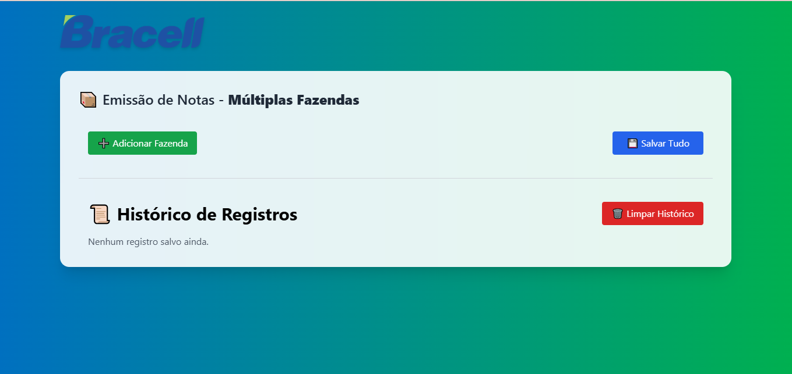

# 📦 Emissor de Notas – PCP Bracell

Sistema interno para facilitar o controle e emissão de Notas Fiscais por transportadoras e fazendas.  
Construído para os analistas e assistentes da Bracell com foco em **velocidade, usabilidade e organização**.

---

## 🌐 Acesse o sistema:

> [🔗 Deploy no Vercel (clique aqui)](https://pcpnotas.vercel.app)  
> _(link de exemplo – substitua pelo seu link real após o deploy)_

---

## 🧱 Tecnologias Utilizadas

- ⚛️ **React + Vite** – front-end ultra rápido e moderno  
- 🎨 **Tailwind CSS** – estilização com classes utilitárias  
- 💾 **IndexedDB (via localStorage)** – persistência local para multiusuário  
- 🔔 **react-hot-toast** – feedback de ações  
- 🚀 **Vercel** – deploy gratuito e instantâneo  
- 💼 **GitHub** – controle de versão

---

## ✨ Funcionalidades

✅ Cadastro de fazendas (múltiplas)  
✅ Adição de várias transportadoras por fazenda  
✅ Resumo instantâneo de notas por transportadora  
✅ Copiar chaves de acesso com um clique  
✅ Toasts de sucesso e feedbacks amigáveis  
✅ Campos persistidos no navegador  
✅ Interface adaptada à rotina dos analistas Bracell  
✅ Pronto para múltiplos terminais simultâneos

---

## 📸 Preview

  
> _(adicione um print bonito aqui da tela principal do sistema)_

---

## 📦 Instalação local (dev)

🛠️ Estrutura

src/
├── components/
│   ├── FazendaForm.jsx
│   ├── FazendaFormGroup.jsx
│   ├── TransportadoraBloco.jsx
│   └── Historico.jsx
├── styles.css
├── App.jsx
└── main.jsx


💙 Desenvolvido por
Bracell – PCP Interno
Com amor e dedicação pelo time de analistas e devs 💼👨‍💻

"O que antes era anotado no caderno, agora é gerenciado com estilo e agilidade!"

---

## 🛡️ Configurar variáveis de ambiente (Supabase)

Para não expor chaves no repositório, o projeto usa variáveis de ambiente no Vite.

Crie um arquivo `.env` na raiz do projeto com o conteúdo:

```
VITE_SUPABASE_URL=https://<seu-projeto>.supabase.co
VITE_SUPABASE_ANON_KEY=eyJ...SEU_ANON_KEY...xyz
```

Substitua os valores pelos da sua instância Supabase. Reinicie o servidor de desenvolvimento após adicionar o arquivo.

### Rodando em desenvolvimento

```powershell
npm install
npm run dev
```

Isso iniciará o Vite em modo dev e permitirá que a aplicação use as variáveis `import.meta.env.VITE_SUPABASE_*`.